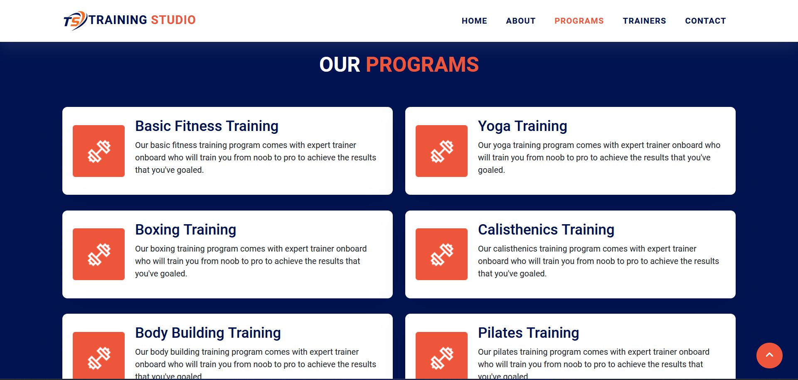

# Simple Gym Website

## Table of contents

- [Introduction](#introduction)
- [Screenshot](#screenshot)
- [Links](#links)
- [Technology](#technology)
- [Resources](#resources)
- [Author](#author)

## Introduction

This is a simple single page responsive website built with HTML, CSS & JavaScript. This website is based on a gym which represents the info about the gym which is divided in 5 sections namely, home, about, programs, trainers & contact.

### Screenshot

### Links

- Live Demo: [https://faisalalware.github.io/simple-gym-website/](https://faisalalware.github.io/simple-gym-website/)

### Technology

- HTML
- CSS
- JavaScript
- Bootstrap
- Responsive Layout

### Resources

- [W3Schools](https://www.w3schools.com/) - I used this website for learning purpose and as a resource for my projects because, it contains detailed concepts of programming languages which helps me to refresh my tech concepts and gets updated as new technology arrives.

- [Pexels](https://www.pexels.com/) - I used this website to use high quality images in my projects.

## Author

- LinkedIn - [Faisal Alware](https://www.linkedin.com/in/faisal-alware-048763b8/)
- Github - [faisalalware](https://github.com/faisalalware)
