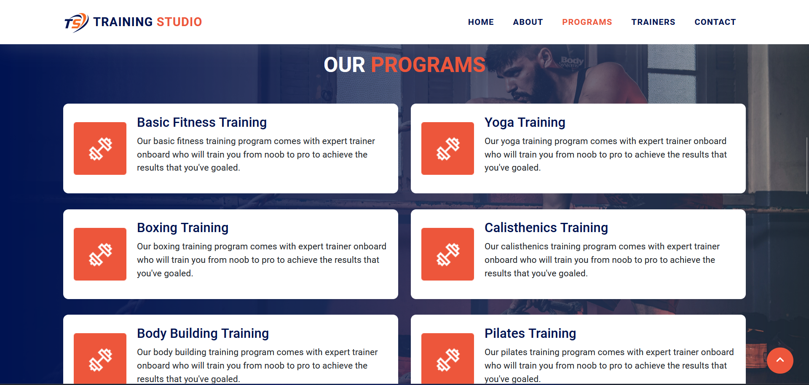

# Simple Gym Website

## Table of contents

- [Introduction](#introduction)
- [Screenshot](#screenshot)
- [Links](#links)
- [Technology](#technology)
- [Resources](#resources)
- [Author](#author)

## Introduction

This is a simple single page website built with HTML, CSS & JavaScript. This website is based on a gym which represents information about the gym in 5 sections such, home, about, programs, trainers & contact.

### Screenshot

### Links

- Live Demo: [https://faisalalware.github.io/simple-gym-website/](https://faisalalware.github.io/simple-gym-website/)

### Technology

- HTML
- CSS
- JavaScript
- Bootstrap
- Responsive Layout

### Resources

- [W3Schools](https://www.w3schools.com/) - I used this website as a resource because, it has detailed concepts of various technologies.

- [Pexels](https://www.pexels.com/) - I used this website to use high quality images in my project.

## Author

- LinkedIn - [Faisal Alware](https://www.linkedin.com/in/faisal-alware-048763b8/)
- Github - [@faisalalware](https://github.com/faisalalware)